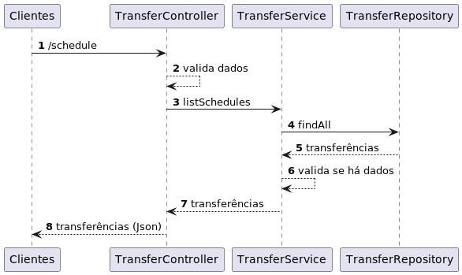
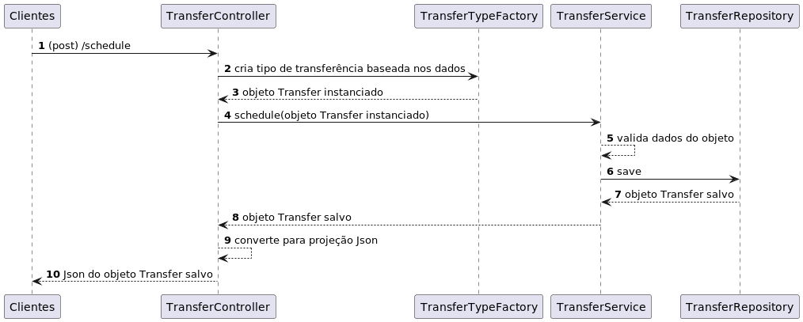
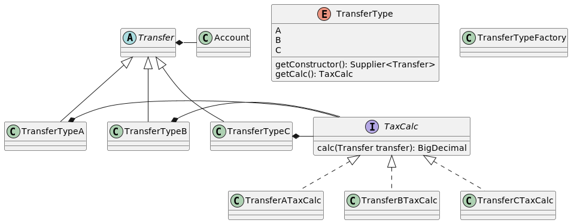

<p align="center">
  

  

  <a href="https://www.twitter.com/ivanqueiroz/">
    
  </a>

  <a href="https://github.com/ivanqueiroz/transfer-scheduler/commits/master">
    
  </a>

   
   <a href="https://github.com/ivanqueiroz/transfer-scheduler/stargazers">
    
  </a>

  <a href="https://curriculo-ivanqueiroz.herokuapp.com/">
    
  </a>

  <a href="https://ivanqueiroz.dev/">
    
  </a>

  
</p>

<h4 align="center"> 
	🚧  Transfer Scheduler API :moneybag:️ Concluído 🚀 🚧
</h4>

<p align="center">
 <a href="#-sobre-o-projeto">Sobre</a> •
 <a href="#%EF%B8%8F-funcionalidades">Funcionalidades</a> •
 <a href="#open_book-documenta%C3%A7%C3%A3o-da-api">Documentação da API</a> • 
 <a href="#-como-executar-o-projeto">Como executar</a> • 
 <a href="#-tecnologias">Tecnologias</a> •
 <a href="#transfer-scheduler#triangular_ruler-arquitetura">Arquitetura</a> •
 <a href="#-contribuidores">Contribuidores</a> • 
 <a href="#-autor">Autor</a> 
</p>

## 💻 Sobre o projeto

:moneybag: Transfer Scheduler — é uma API em REST que realiza o agendamento de transferência financeiras.

---

## ⚙️ Funcionalidades

- [x] Agendamento de transferências
  - [x] Cálculo da taxa da transferência
- [x] Listagem de todas as transferências agendadas
- [X] Internacionalização das mensagens de erro

---

### Swagger

- http://localhost:8080/transfer/docs

---

## 🚀 Como executar o projeto

Este projeto inicia um servidor na porta 8080, pronto para receber requisições REST.

### Pré-requisitos

Antes de começar, você vai precisar ter instalado na sua máquina as seguintes ferramentas:
[Git](https://git-scm.com), [Java 18+](https://www.oracle.com/java/technologies/downloads/#java18) e o [Gradle](https://docs.gradle.org/current/userguide/userguide.html).

Além disso, é bom ter uma IDE para trabalhar com o código como [IDEA](https://www.jetbrains.com/pt-br/idea/download/) ou o [Spring Tools Suite](https://spring.io/tools).

Para testar a API é necessária uma ferramenta client REST como o [Postman](https://www.postman.com/downloads/).

#### 🎲 Rodando o Backend

```bash

# Clone este repositório
$ git clone git@github.com:ivanqueiroz/transfer-scheduler.git

# Acesse a pasta do projeto no terminal/cmd
$ cd transfer-scheduler

# Instale as dependências
$ ./gradlew clean build (Linux) ou ./gradlew.bat clean build (Windows)

# Execute a aplicação em modo de desenvolvimento
$ ./gradlew bootRun (Linux) ou ./gradlew.bat bootRun (Windows)

# O servidor inciará na porta:8080 - acesse http://localhost:8080 
```

## Get (Listar agendamentos)

Parametros Consulta

- Endpoint: http://localhost:8080/transfer/v1/schedule?page=0&size=20
- page = Pagina atual. Default = 0
- size = Tamanho da página a ser buscada no banco. Default = 20

### Request

```shell
curl --location --request GET 'http://localhost:8080/transfer/v1/schedule?page=0&size=20'
```

### Response

```shell
{"content":[{"id":1,"amount":30.00,"taxAmount":3.90,"transferDate":"2022-05-15","scheduleDate":"2022-05-15","accountSource":"114299997","accountDestination":"119318209"}],"pageable":{"sort":{"empty":true,"sorted":false,"unsorted":true},"offset":0,"pageNumber":0,"pageSize":20,"paged":true,"unpaged":false},"totalPages":1,"totalElements":1,"last":true,"size":20,"number":0,"sort":{"empty":true,"sorted":false,"unsorted":true},"first":true,"numberOfElements":1,"empty":false}
```

## Post (Salvar agendamento)

### Request

```shell
curl --location --request POST 'http://localhost:8080/transfer/v1/schedule' \
--header 'Content-Type: application/json' \
--data-raw '{
"amount":30,
"transferDate": "2022-05-15",
"accountSource": "114299997",
"accountDestination": "119318209"
}'
```

### Response

```shell
{
    "id": 1,
    "amount": 30,
    "taxAmount": 3.90,
    "transferDate": "2022-05-15",
    "scheduleDate": "2022-05-15",
    "accountSource": "114299997",
    "accountDestination": "119318209"
}
```

## Internacionalização

As mensagens de erro da api são internacionalizadas para português e inglês, para alterar é necessário passar a
header **Accept-Language** com os valores **pt-BR** ou **en-US**, ex.:

### Request (en-US)

```shell
curl --location --request POST 'http://localhost:8080/transfer/v1/schedule' \
--header 'Content-Type: application/json' \
--header 'Accept-Language: en-US' \
--data-raw '{
"transferDate": "2022-05-15",
"accountSource": "114299997",
"accountDestination": "119318209"
}'
```

### Response (en-US)

```shell
{
    "statusCode": 400,
    "message": "[The ammount cannot be empty]"
}
```

### Request (pt-BR)

```shell
curl --location --request POST 'http://localhost:8080/transfer/v1/schedule' \
--header 'Content-Type: application/json' \
--header 'Accept-Language: pt-BR' \
--data-raw '{
"transferDate": "2022-05-15",
"accountSource": "114299997",
"accountDestination": "119318209"
}'
```

### Response (pt-BR)

```shell
{
    "statusCode": 400,
    "message": "[O valor não pode estar vazio]"
}
```

## Docs

- http://localhost:8080/transfer/docs
- http://localhost:8080/transfer/api-docs

## Actuator (monitoramento)

- Actuator: http://localhost:8080/transfer/actuator
- Info: http://localhost:8080/transfer/actuator/info
- Health check: http://localhost:8080/transfer/actuator/health
- Metrics: http://localhost:8080/transfer/actuator/metrics

---

## 🛠 Tecnologias

As seguintes ferramentas foram usadas na construção do projeto:

#### [](https://github.com/ivanqueiroz/transfer-scheduler#server-springboot)**Server**

- **[Spring Boot](https://spring.io/projects/spring-boot)** — Framework escolhido por ser _stand-alone_ e requerer menor esforço para iniciar o desenvolvimento das regras de negócio.
- **[Spring Data JPA](https://spring.io/projects/spring-data-jpa)** — Escolhido para criar as operações com o banco de dados. Também reduziu o esforço para iniciar o desenvolvimento por criar as
  operações mais comuns (_CRUD_).
- **[Spring Boot Actuator](https://docs.spring.io/spring-boot/docs/current/reference/html/actuator.html)** — Permite a monitoração da aplicação remotamente. No Transfer Scheduler as permissões são:
  health, info, mappings, loggers, scheduledtasks e caches.
- **[Bean Validator](https://beanvalidation.org/2.0-jsr380/)** — Utilizado para validação dos valores passados para a API, permite a verificação através de anotações.
- **[Lombok](https://projectlombok.org/)** — Diminui a quantidade de código escrito utilizando anotações para gerar trechos comuns durante a compilação.
- **[H2 Database](https://www.h2database.com/html/main.html)** — Banco de dados em memória (embedded). Para o propósito do projeto encaixou-se bem e é o banco principal que registra os agendamentos.
- **[OpenAPI 3 & Spring Boot (Swagger)](https://springdoc.org/)** — Plugin para o Spring Boot que gera a documentação da API do Transfer Scheduler.

> Veja o arquivo [build.gradle](https://github.com/ivanqueiroz/transfer-scheduler/blob/master/build.gradle)

---

## :triangular_ruler: Arquitetura

O Transfer Scheduler foi criado como uma API Rest visando a simplicidade de utilização devido a popularidade do formato.

### Organização dos arquivos (pacotes)

Baseados em princípios do DDD, a organização do projeto é dividido em duas grandes camadas:

- **application** — Camada que contém todos os arquivos referentes às camadas de interação com o usuário e/ou relacionadas ao framework utilizado.
  - **config** — contém arquivos/classes de configuração do projeto.
  - **web** — subcamada de application que contém toda a implementação web da aplicação. Dentro da raiz desse package é colocado
    coisas específicas do framework tais como: controllers, filtros e classes para objeto de transferência de dados entre camadas (dto's).
- **domain** — Camada que encapsula e isola todas as regras de negócio do projeto, evitando ter dependências implícitas ou
  explícitas das outras camadas.
  - **entities** — As entidades de negócio ficam aqui.
  - **repositories** — Interfaces do [Spring Data JPA](https://spring.io/projects/spring-data-jpa) para a manipulação das operações de banco.
  - **service** — Classes que representam os serviços de execução do negócio do sistema.
  - **factories** — Classes de criação de instâncias de entities.
  - **exceptions** — Classes que representação exceções de negócio.

### Camadas lógicas

O programa foi pensado em 3 camadas lógicas:

- **Controller** — Responsável por responder as requisições. Nessa camada é realizada as validações dos dados enviados ([Bean Validator](https://beanvalidation.org/2.0-jsr380/)) antes de serem
  transferidas para a camada de negócio e a padronização da resposta de exceções.
- **Service** — Onde as regras de negócio e processamento são executadas.
- **Repository** — Camada responsável pela persistência e manipulação dos dados no banco de dados.

O Controller recebe as requisições dos clientes, realiza a validação dos dados, envia para a camada de serviço. A camada de serviço realiza a validação da consistência da informação passada e executa
a operação.
Após a persistência a camada de serviço devolve a transferência salva. O ciclo é encerrado com o retorno serializado em JSON pelo controller.
Caso haja um erro o mesmo é tratado pelo handler de erros na camada web, que padroniza o JSON para a resposta.

O diagrama de sequência de listagem de transferências:

<p align="center" style="display: flex; align-items: flex-start; justify-content: center;">
  
</p>

O diagrama de sequência da ação de salvar a transferência:

<p align="center" style="display: flex; align-items: flex-start; justify-content: center;">
  
</p>

### Design

Para atender ao requisito de permitir mudanças e inclusões futuras, o código foi desenhado para encapsular o algoritmo de cálculo das taxas dentro de classes e usar o polimorfismo para abstrair a
chamada ao código.
As instâncias dos objetos que representam uma transferência, são realizadas por uma fábrica, diminuindo o acoplamento entre as classes já que não é necessário conhecer as implementações, as regras de
agendamento definem o tipo da transferência e os mesmos definem qual o cálculo a ser utilizado.

O diagrama de classes:

<p align="center" style="display: flex; align-items: flex-start; justify-content: center;">
  
</p>

### Testes

Os testes criados são:

- **TransferTypeFactoryTest** — Realiza os testes da fábrica dos tipos de Transfer.
- **CalculationTests** — Testa a validação dos cálculos de taxas.

## 🦸 Autor

<a href="https://ivanqueiroz.dev">
 
 <br />
 <sub><b>Ivan Queiroz</b></sub></a> <a href="https://ivanqueiroz.dev" title="Blog Ivan Queiroz">🚀</a>
 <br />

[](https://twitter.com/ivanqueiroz) [](https://www.linkedin.com/in/ivanqueiroz/)
[](mailto:ivanqueiroz@gmail.com)

---

Feito com ❤️ por Ivan Queiroz 👋🏽 [Entre em contato!](https://www.linkedin.com/in/ivanqueiroz/)

---
